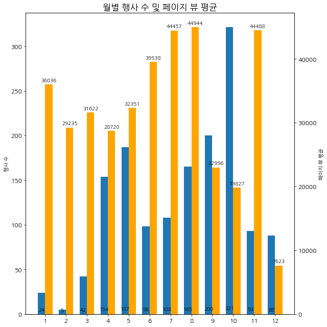
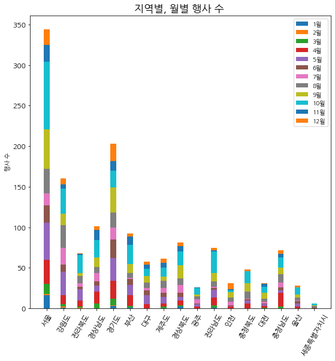
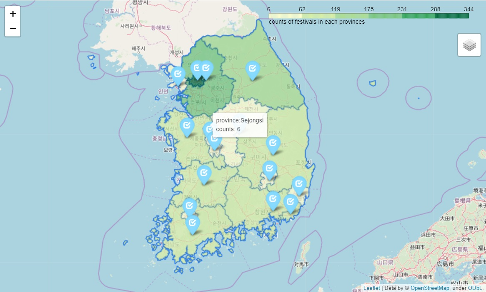
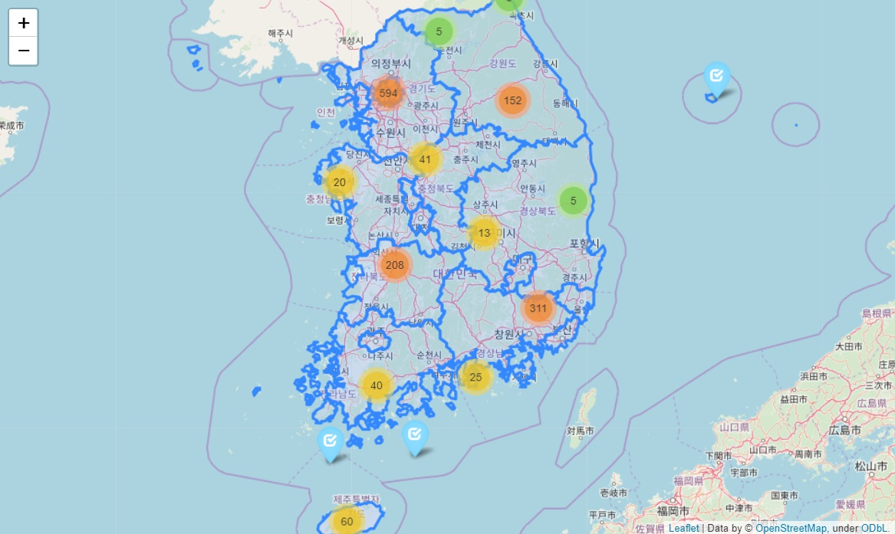
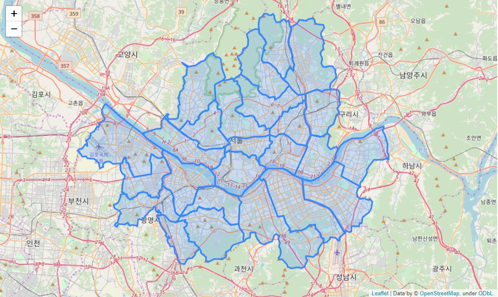
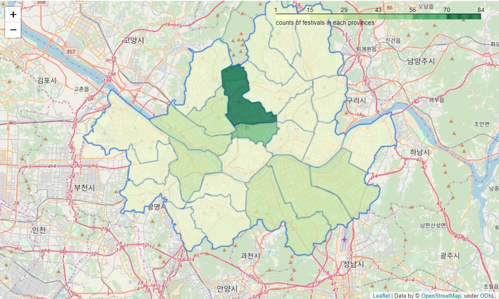
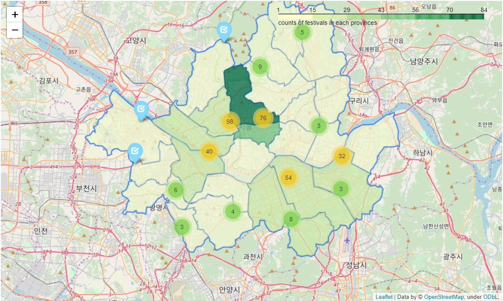
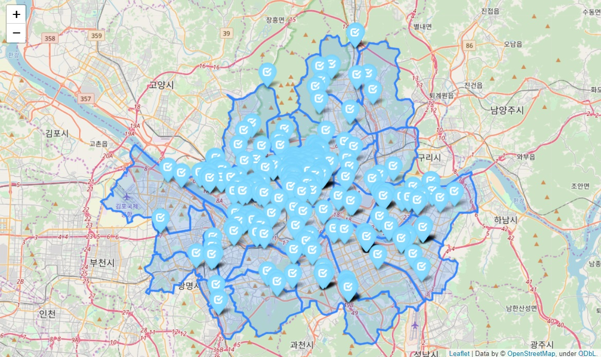
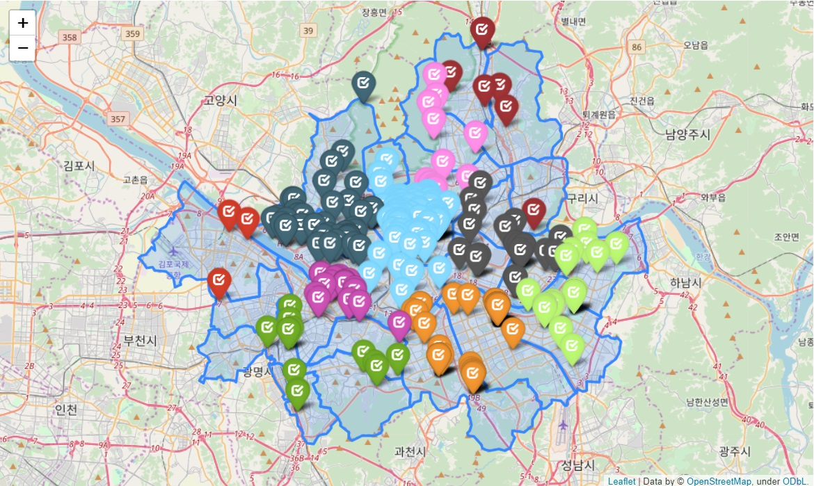

# tourAPI_visualizaion
Data collecting with API and visualization using `matplot`, `folium`

* 한국관광공사에서 제공하는 tourAPI를 이용하여 2019년의 축제 및 행사들의 데이터를 수집하고, 시각화했습니다. 
* `matplot` 라이브러리를 이용하여 그래프를 그리고 데이터의 특성을 파악했습니다. 
* SouthKorea 깃허브에서 제공하는 `GeoJson`과 `folium.Choropleth` , `MarkerCluster()` , `folium.marker` 를 이용하여 다양한 시각화를 했습니다.
* 서울의 시각화를 위해 편집한 데이터를 함께 올립니다. `geo_data/skorea-municipalities-2018-geo-seoul2.json`

## Language
Python 3.7.4  

## Summary

#### matplot을 이용한 시각화
  
봄(3,4월)과 가을(9, 10월)에 행사 수가 많은 것을 알 수 있다.     
여름(6, 7월)의 행사에 대한 페이지 뷰의 평균이 높은걸로 보아 여름에 하는 행사에 대한 관심이 많다는 것을 알 수 있다.     


  
서울, 경기도, 강원도 순으로 행사 수가 많다.    
각 지역별 바의 색 분포를 보았을 때, 분포가 비슷한 것을 보아 지역에 따른 월별 행사 분포는 대체로 비슷한 것을 알 수 있다.  

#### folium을 이용한 visualization
#### 1. folium의 Choropleth 이용한 지역별 행사 수 시각화
  
마우스 커서를 pin에 올리면 지역명과, 그 지역의 행사 수를 보여준다.  
```
 # 우리나라 지도 데이터 geo_json 경로 설정
geo_path_pro ="geo_data/skorea-provinces-2018-geo.json"
geo_str_pro = json.load(open(geo_path_pro, encoding="utf-8")) # geo_json 열기


korea_center = [35.95, 128.25] # 처음 지도 화면의 중심이 될 좌표
# map 생성
map = folium.Map(location=seoul_center, zoom_start=7)  
# map에 GeoJson Layer(파란색 테두리)를 provinces이름으로 추가한다. 
folium.GeoJson(geo_str_pro, name='provinces').add_to(map) 


folium.Choropleth(
        geo_data=geo_str_pro,
        name='choropleth',
        data=df_2019_final_pro, # 이용한 데이터 프레임
        columns=['name_eng', 'pro_counts'], # geojason파일에서 지역명(name_eng)과 색을 결정할 이벤트 갯수(pro_count) 
        key_on='properties.name_eng', # geojson데이터에서 사용하려는 ID 찾아서 입력.
        fill_color='YlGn',
        fill_opacity=0.7,
        line_opacity=0.2,
        legend_name='counts of festivals in each provinces',
    ).add_to(map) # Choropleth을 map에 추가한다.
    
 # layerControl을 map에 추가한다
folium.LayerControl().add_to(map)

for n in range(df_2019_final_pro.shape[0]):
    location = [df_2019_final_pro["centery"][n],df_2019_final_pro["centerx"][n]]
    tooltip = "province:{}<br> counts: {}".format(df_2019_final_pro["name_eng"][n], df_2019_final_pro['pro_counts'][n])
    # marker를 map에 추가한다.
    folium.Marker(location, icon=folium.Icon(icon="check",color="lightblue"), tooltip = tooltip).add_to(map) 
map
```
#### 2. folium의 markerCluster 이용한 지역별 행사 수 clustering 시각화 
  
  
```
geo_path_pro ="geo_data/skorea-provinces-2018-geo.json"
geo_str_pro = json.load(open(geo_path_pro, encoding="utf-8"))


korea_center = [35.95, 128.25]
map = folium.Map(location=seoul_center, zoom_start=7)
folium.GeoJson(geo_str_pro, name='provinces').add_to(map)

marker_cluster = MarkerCluster().add_to(map) # create marker clusters # MarkerCluster를 map에 추가

for n in range(df_2019_final.shape[0]):
    location = [df_2019_final["mapy"][n],df_2019_final["mapx"][n]]
    tooltip = "title:{}<br> address: {}".format(df_2019_final["title"][n], df_2019_final['address'][n])
    folium.Marker(location, icon=folium.Icon(icon="check",color="lightblue"), tooltip = tooltip).add_to(marker_cluster)
map
```
#### 3. GeoJson을 이용한 서울의 구 지도 시각화
   

```
# 'skorea-municipalities-2018-geo' json 파일을 이용, 서울의 17개의 '구'만 추려서 만든 geonjson파일입니다. 
# Id로 "name_eng"을 이용했습니다. 다른 도의 '구'의 name_eng를 이용하여 도별 파일을 만들 수  있습니다. 
geo_path_seoul ="geo_data/skorea-municipalities-2018-geo-seoul2.json"
geo_str_seoul = json.load(open(geo_path_seoul, encoding="utf-8"))

seoul_center = [37.541, 126.986]
map = folium.Map(location=seoul_center, zoom_start=11) # map 생성
folium.GeoJson(geo_str_seoul, name='seoul').add_to(map) # GeoJson을 map에 추가
map
```
#### 4. folium의 Choropleth 이용한 서울의 구별 행사 수 시각화 
  
 
#### 5. folium의 Choropleth, markerCluster 이용한 서울의 구별 행사 수 시각화   
  
서울의 중심부(종로구)와 한강 주변에 행사가 밀집되어 있는 것을 알 수 있다.   

#### 6. 좌표를 이용해 서울 내 행사가 일어난 곳에 marker를 삽입.  
  

#### 7. 구별 marker의 색 변경.   
  

## Reference & License
 
[tourAPI from Korea Tourism Organization](http://api.visitkorea.or.kr/)

[GeoJson from SouthKorea github](https://github.com/southkorea/southkorea-maps)

[Folium Documentation](https://python-visualization.github.io/folium/index.html) 

